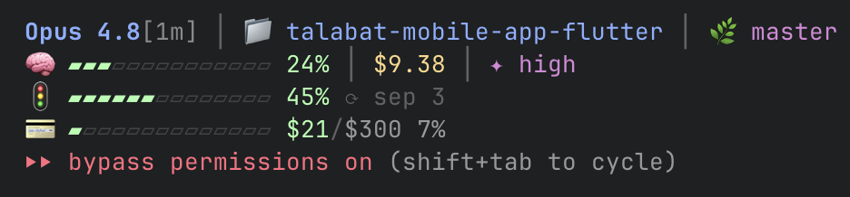

# cc-statusline-chili-edition 🌶️

An informative multi-line status line for [Claude Code](https://code.claude.com): model & repo identity, context usage, session cost, reasoning mode, and account limits (quota + credits) as segmented bars.



## Install

```bash
curl -fsSL https://raw.githubusercontent.com/sergchil-tb/cc-statusline-chili-edition/main/install.sh | bash
```

Or clone and run:

```bash
git clone https://github.com/sergchil-tb/cc-statusline-chili-edition.git
cd cc-statusline-chili-edition && ./install.sh
```

The installer copies `statusline.sh` to `~/.claude/` (backing up any existing one) and sets `statusLine` in `~/.claude/settings.json`. Open Claude Code to see it.

## What it shows

```
Opus 4.8[1m] │ 📁 project │ 🌿 branch     ← model (·[1m] = 1M ctx) · folder · git branch
🧠 ▰▰▱… 24% │ $9.38 │ ✦ high              ← context used · session cost · thinking/effort
🚦 ▰▰▰… 45% ⟳ sep 3                       ← rate-limit / plan quota + reset
💳 ▰… $21/$300 7%                         ← extra credits used / limit
```

Bars are green < 50% · yellow 50–80% · red > 80%. On Pro/Max the limit rows show 5-hour (⏱) and weekly (📅) instead of the enterprise quota.

## Requirements

`jq`, `git`, `curl`, `awk`, a 256-color + emoji-capable terminal. macOS or Linux.

## Customize

All in `statusline.sh` — bar width (`14`), glyphs (`▰`/`▱`), and 256-color codes.

MIT © Sergey Chilingaryan
